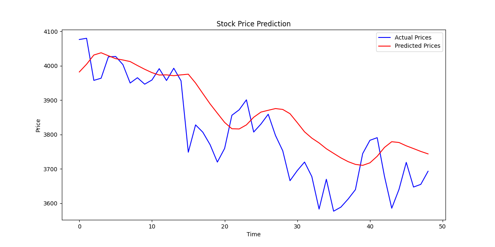

# Stock Price Forecasting with Deep Learning

## Introduction
This project demonstrates how to forecast stock prices using deep learning techniques, specifically Long Short-Term Memory (LSTM) networks. The goal is to predict future stock prices based on historical price data.

## Requirements
- Python (3.6+)
- TensorFlow (2.x)
- NumPy
- pandas
- scikit-learn
- Matplotlib

## Dataset
You will need a historical stock price dataset in Excel format (e.g., `stock_price.xlsx`). This dataset should include at least two columns: `Date` and `Close*`, where `Date` represents the date of the stock price and `Close*` represents the closing price of the stock on that date.

## Usage
1. Place your dataset file (`stock_price.xlsx`) in the same directory as the code.
2. Open the provided Python script (`stock_price_forecasting.py`) and ensure you have installed all the required libraries.
3. Run the script to train the LSTM model and make stock price predictions.
4. The script will also calculate the Root Mean Squared Error (RMSE) between actual and predicted prices and display a plot comparing them.

## Configuration
You can adjust the following parameters in the script to customize the forecasting model:
- `sequence_length`: Length of input sequences (experiment with different values).
- `LSTM units`: Number of LSTM units in the model architecture (adjust as needed).
- `epochs`: Number of training epochs.
- `batch_size`: Batch size for training.


## Predicting Future Prices
The script includes a function `predict_future_prices` that can be used to predict future stock prices. Example usage:
```python
starting_data = X_test[-1].reshape(sequence_length, 1)
forecasted_prices = predict_future_prices(model, starting_data, num_days=5)
print("Forecasted Prices for the Next 5 Days:")
print(forecasted_prices)
```




**Root Mean Squared Error (RMSE): 98.39233574605251**


References
=======
## References
>>>>>>> f85dcf6e0875e743c29588e1a4a78329ca06de18
TensorFlow: https://www.tensorflow.org/
NumPy: https://numpy.org/
pandas: https://pandas.pydata.org/
scikit-learn: https://scikit-learn.org/
Matplotlib: https://matplotlib.org/

